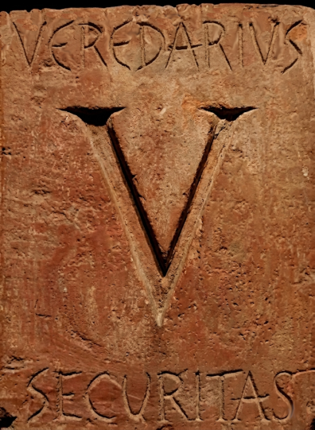
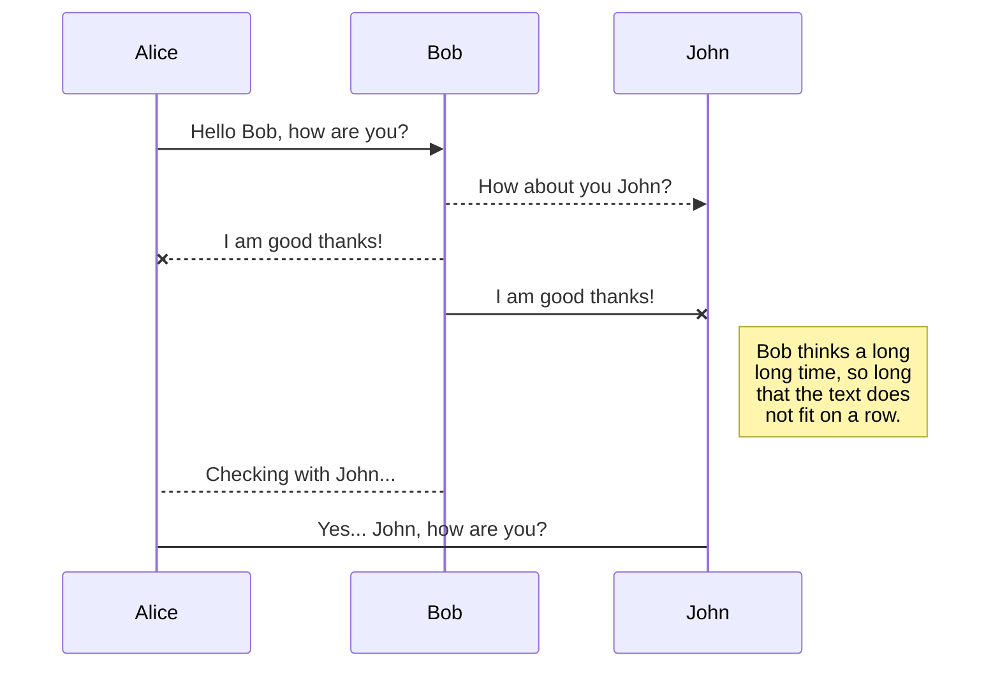
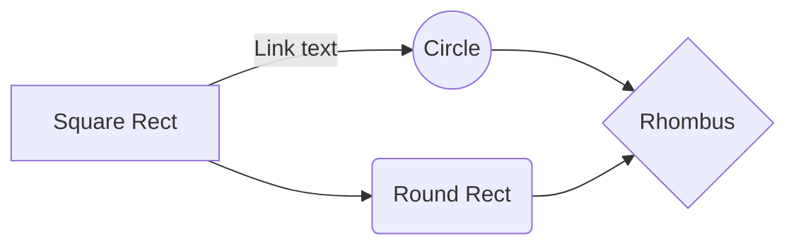

# 

  
---
> "En un mundo fragmentado, la verdadera fuerza reside en la capacidad de conectar sin someterse."
---

## Manifiesto Veredarii: La Red de Interoperabilidad del Futuro Distribuido

  

En la antigua Roma, el **Veredarius** era el encargado de llevar la información crítica a través de las fronteras con velocidad y eficiencia. Hoy, nuestra red recupera ese espíritu para la era digital. **Veredarii** no es solo una herramienta; es una infraestructura de interoperabilidad diseñada bajo los principios de soberanía y libertad tecnológica.

  

---

  

### Enfoque

  

*  **Interoperabilidad sin Permisos:** Creemos en una red donde las entidades puedan comunicarse sin importar su arquitectura interna, eliminando los silos de información.

*  **Seguridad por Diseño:** Basada en una arquitectura de pares (P2P), la seguridad no depende de una autoridad central, sino de la robustez criptográfica de cada entidad.

*  **Gobernanza Descentralizada:** El poder reside en los participantes. No existe un punto único de falla ni una entidad que pueda censurar o apagar la comunicación.

*  **Código Abierto:** La confianza se construye a través de la transparencia. Veredarii es, y siempre será, un bien público digital.

  
### Aspectos claves

*  **libp2p:** Creemos en una red donde las entidades puedan comunicarse sin importar su arquitectura interna, eliminando los silos de información.

*  **Plugins con wasm:** Basada en una arquitectura de pares (P2P), la seguridad no depende de una autoridad central, sino de la robustez criptográfica de cada entidad.

*  **DHT:** El poder reside en los participantes. No existe un punto único de falla ni una entidad que pueda censurar o apagar la comunicación.

  

---
> "En un mundo fragmentado, la verdadera fuerza reside en la capacidad de conectar sin someterse."
---

## SmartyPants

SmartyPants converts ASCII punctuation characters into "smart" typographic punctuation HTML entities. For example:

|                |ASCII                          |HTML                         |
|----------------|-------------------------------|-----------------------------|
|Single backticks|`'Isn't this fun?'`            |'Isn't this fun?'            |
|Quotes          |`"Isn't this fun?"`            |"Isn't this fun?"            |
|Dashes          |`-- is en-dash, --- is em-dash`|-- is en-dash, --- is em-dash|

## UML diagrams

You can render UML diagrams using [Mermaid](https://mermaidjs.github.io/). For example, this will produce a sequence diagram:

And this will produce a flow chart:

---
> "En un mundo fragmentado, la verdadera fuerza reside en la capacidad de conectar sin someterse."
---